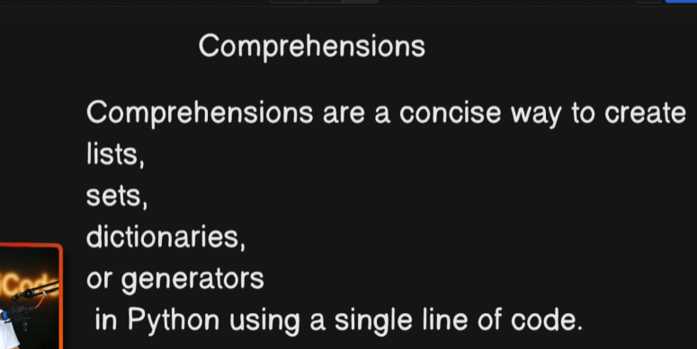

# The all things we can do with comprehension we can do that with loops 

but sometimes comprehensoons make life easier its syntax is easy

Where compehension are used ??
in filtering items 
transforming some objects 
create a new collection
flatten nested structure

What purpose do they sereve???
cleaner code
faster execution

Types of comprehensions???
List
Set
Dictionary
Geneartors 
