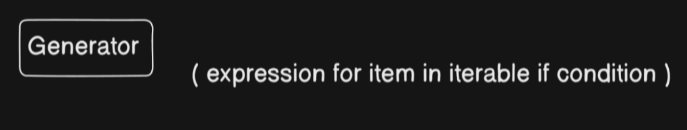
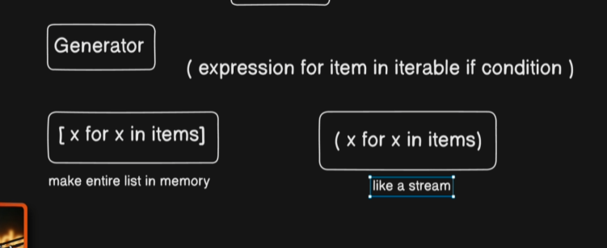

# Generators helps us to save the memory 

# Generators are memory optimized in certain cases so sometimes we use this in place of functions

We save memory
sometimes we dont want results immediatly
lazy evaluations